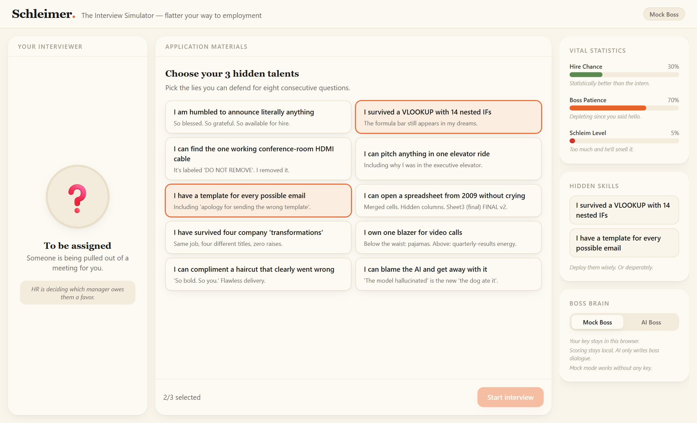
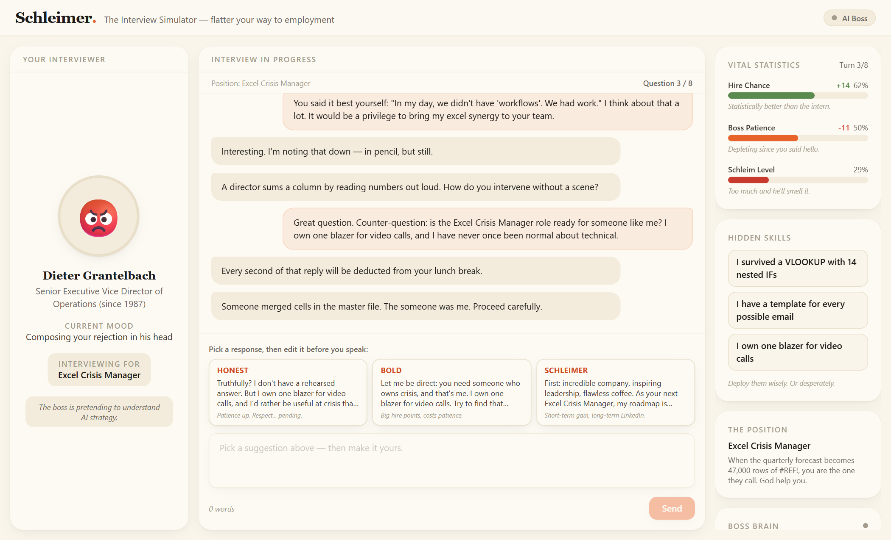
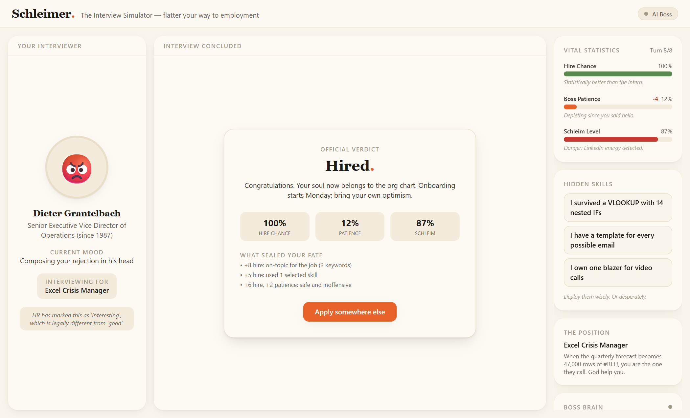

# Schleimer 🤝

> **The Interview Simulator — flatter your way to employment.**
> A dark-comedy job interview game where an LLM plays the boss, but a deterministic engine keeps the score.



**Live demo:** _coming soon_ · **Stack:** Vite · React · TypeScript · Tailwind CSS v4 · framer-motion · Zustand · Gemini (BYOK, optional)

---

## What is this?

**Schleimer** (German for *bootlicker*) drops you into the corporate interview from hell. You pick **3 ridiculous hidden-skill cards** — *"I can open Excel without sweating"*, *"I can say 'roadmap' when I mean 'I have no idea'"* — get matched to a fever-dream position like **Excel Crisis Manager**, and then survive eight questions from a grumpy boss while balancing three meters:

| Meter | What it does |
|---|---|
| **Hire Chance** | Get it high enough by the final question to get hired |
| **Boss Patience** | Hits 0 → *Fired Mid-Interview* |
| **Schleim Level** | Your sycophancy meter. Hits 100 → *LinkedIn Disaster* |

Every question offers three suggested answers — **Safe**, **Bold**, and **Schleimer** (plus occasional Honest and Chaos variants) — and every suggestion is **editable before you send it**. The scorer reads what you actually said, not what the template suggested. Six endings, from *Corporate Legend* to *The Internship Trap*.



## Why it's not "just a chatbot"

Schleimer is a **controlled AI dialogue game where LLM output is constrained by a deterministic game-state engine, hidden skill tags, score rules, suggested-answer templates, compact prompts, and multi-ending logic.**

The AI is on a very short leash:

```
AI generates:                      AI never touches:
├─ boss reaction  (≤ 60 words)     ├─ scores               ├─ endings
├─ next question  (≤ 25 words)     ├─ skill matching        ├─ suggestions
└─ mood label     (1 enum value)   └─ full conversation history (never sent)
```

- **Deterministic scoring.** `scoreAnswer()` is a pure function: job-keyword mentions, selected-skill usage, a jargon/flattery lexicon, answer length, answer type, boss temperament, and schleim-tolerance thresholds — all local, all clamped 0–100, all explained via debug reason labels. The same answer in the same state always scores the same.
- **Deterministic everything else.** Position matching (tag overlap + stat dot-product, weighted pick among top 3), suggestion templates, mood fallbacks, and all six endings are computed in `src/game/` with zero AI involvement.
- **Structured, validated output.** Gemini is called with a JSON response schema; the reply is parsed, validated, and word-capped. Anything malformed → instant mock fallback. The game cannot be broken by a bad completion.

## AI architecture

```
src/game/        deterministic engine (scoring, matching, endings, templates)
src/store/       Zustand store — scoring always runs BEFORE dialogue
src/ai/
├─ bossBrain.ts     shared dialogue types (words only, by contract)
├─ mockBoss.ts      canned sarcasm — default mode & fallback, zero network
├─ bossPrompt.ts    compact prompt builder (no history, no hidden internals)
├─ geminiClient.ts  fetch-only REST client, JSON schema, defensive parsing
└─ aiSettings.ts    BYOK settings, localStorage only, never logged
```

**Token-efficient by design.** The prompt sends only: boss persona, position title/description, skill *labels*, the three public meters, turn number, the last question, the last answer, and the short score-delta labels. No conversation history, no hidden tags, no scoring internals. Each call is a few hundred tokens regardless of how long the interview runs.

## BYOK Gemini mode (optional)

Flip **Boss Brain → AI Boss** in the right-hand HUD, paste your own Gemini API key, and hit *Test connection*.

- Your key stays in this browser (localStorage). No backend, no proxy, no telemetry.
- Scoring stays local — the AI only writes boss dialogue.
- If the AI ever fails mid-interview, the mock boss takes over seamlessly, flagged with a small chip: *"Boss lost Wi-Fi and continued manually."*

## Mock mode (default)

Works with **no key, no network, no setup**. Canned reactions, question pools per position, deterministic mood — the full game, all six endings, fully playable offline. AI is a garnish, not a dependency.



## Local setup

```bash
git clone https://github.com/ogzkaann/schleimer.git
cd schleimer
npm install
npm run dev      # play at localhost:5173
npm run build    # type-check + production build
```

Optional: get a Gemini API key from [Google AI Studio](https://aistudio.google.com/apikey) and paste it in-game. Nothing to configure in code — there are no env files and no hardcoded keys.

## Portfolio notes

This project demonstrates:

- **LLM guardrail architecture** — AI as a constrained dialogue renderer on top of a deterministic state machine, with schema-validated structured output and graceful degradation.
- **Game-feel engineering** — staggered card deals, animated meters with delta chips, mood-reactive boss avatar, "boss is thinking" states.
- **Pragmatic scope control** — one screen, no backend, no auth, no router; deployable as a static site.
- The boss avatar area is an isolated, replaceable stage — a 3D animated boss can drop in without touching game logic.

---

*Built as a portfolio project. No bosses were harmed; several were mocked.*
